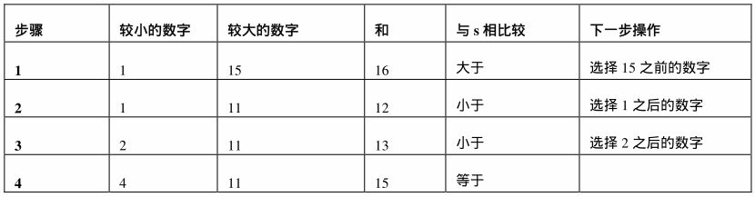
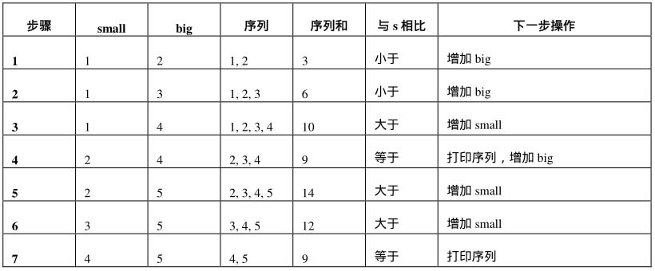

[TOC]


---

# 剑指offer

### Main5：从尾到头打印链表

---

2018/5/16 星期三

> **题目描述**：输入个链表的头结点，从尾到头反过来打印出每个结点的值。 

设计一个链表结点

```java
    class ListNode<T> {
        T val;
        ListNode next = null;

        ListNode(T val) {
            this.val = val;
        }
    }
```

利用堆栈可以很方便的实现这个目的

```java
    public ArrayList<Integer> printListFromTailToHead(ListNode listNode) {
        Stack<Integer> stack = new Stack<>();
        ListNode current = listNode;
        while (current != null) {
            stack.push(current.val);
            current = current.next;
        }
        ArrayList<Integer> result = new ArrayList<>();
        while (!stack.isEmpty()) {
            result.add(stack.pop());
        }
        return result;
    }
```


### Main6 题目：重建二叉树

> 题目描述：输入某二叉树的前序遍历和中序遍历的结果，请重建出该二叉树。假设输入的前序遍历和中序遍历的结果中都不含重复的数字。例如：前序遍历序列｛ 1, 2, 4, 7, 3, 5, 6, 8｝和中序遍历序列｛4, 7, 2, 1, 5, 3,  8，6}，重建出下图所示的二叉树并输出它的头结点。 

构建二叉树的结点类

```java
    class TreeNode {
        int val;
        TreeNode left;
        TreeNode right;

        TreeNode(int x) {
            val = x;
        }
    }
```

构建二叉树

```java
    public TreeNode reConstructBinaryTree(int[] pre, int[] in) {
        return reConstructBinaryTree(pre, 0, pre.length - 1, in, 0, in.length - 1);
    }

    private TreeNode reConstructBinaryTree(int[] pre, int preStart, int preEnd, int[] in, int inStart, int inEnd) {
        if (preStart > preEnd || inStart > inEnd) {
            return null;
        }
        TreeNode root = new TreeNode(pre[preStart]);
        for (int i = inStart; i <= inEnd; i++) {
            if (root.val == in[i]) {
                root.left = reConstructBinaryTree(pre, preStart + 1, preStart + i - inStart, in, inStart, i - 1);
                root.right = reConstructBinaryTree(pre, preStart + 1 + i - inStart, preEnd, in, i + 1, inEnd);
                break;
            }
        }
        return root;
    }
```


### 笔试题10：二进制中1的个数 

> **题目描述：**输入一个整数，输出该数二进制表示中1的个数。其中负数用补码表示。 

### 笔试题11：数值的整数次方

>  题目描述：实现函数 double Power(double base,int exponent),求base的exponent次方。不得使用库函数，同时不需要考虑大树问题。

分析：自以为简单的题目，直接累成exponent次就可以啦。代码如下：

```java
    double Power(double base,int exponent){
        double result = 1.0;
        for(int i = 0, i <= exponent; i++){
            result *= base;
        }
    }
```

很简答，但是没充分的考虑到一些边界条件。如果输入的指数(exponent)为0或者为负数怎么办。考虑情况。

解析：底数是double类型，指数是int类型。分为多种情况。

- 底数为0，则直接返回0，且指数为负数，没有意义。
- 底数为1，则直接返回1。
- 指数为正：常规的解法$a^b=a*a*a...$
- 指数为0：返回为1
- 指数为负数：可以认为是，现将$a^{-b}=(\frac 1a)^b = \frac 1{a^b}$等形式。

上面是考虑的所有特殊情况。代码实现如下：

```java
	private Double PowerWithUnsignedExponent(Double base, int exponent) {
        if (base == 1) {
            return base;
        }
        if (exponent == 0) {
            return 1.0;
        }
        // 用右移运算符代替除以2
        Double result = PowerWithUnsignedExponent(base, exponent >> 1);
        result *= result;
        // 用位&运算符来判断一个数是否为奇数还是偶数
        if ((exponent & 0x01) != 0) {
            result *= base;
        }
        return result;
    }

    private double Power(Double base, int exponent) throws Exception {
        if (equal(base, 0.0) && exponent < 0) {
            throw new Exception("０的负数次幂无意义");
        }
        if (equal(exponent, 0)) {
            return 1.0;
        }
        double result = 0.0;
        if (exponent < 0) {
            result = PowerWithUnsignedExponent(1.0 / base, -exponent);
        } else {
            result = PowerWithUnsignedExponent(base, exponent);
        }
        return result;
    }

    /* 判断两个double型数据，计算机有误差 */
    private boolean equal(double num1, double num2) {
        return ((num1 - num2 > -0.0000001) && num1 - num2 < 0.0000001);
    }
```

扩展：但是如果，指数也可以为double类型，该如何计算？


### 面试题12：打印1到最大的n位数

> 题目描述：输入数字n，按顺序打印出从1到最大的n位数十进制数。比如输入3，则打印出1、2、3一直到最大的3位数，即999。

粗看起来感觉很简单，感觉没有啥坑。可能会傻傻的写下如下代码：

```java
    void PrintToMaxOfNDigits_1(int n) {
        int number = 1;
        int i = 0;
        // 找出最大值
        while (i++ < n) {
            number *= 10;
        }
        // 开始打印
        for (int j = 0; j < number; j++) {
            System.out.printf("%d、", j);
        }
    }
```

但是，当我们输入的n很大的时候，这样计算肯定会出现溢出，这时就需要去考虑**大树**问题。在字符串上模拟数字加法的解法，绕过陷阱才能拿到offer。

解析：经过前面的分析很容易的想到使用**String**或者**数组**来表示大树。用字符串来表示数字的时候，输入n位数字，我们需要定义n+1长度的字符串（最后一个字符串的结束符号'\0'）。这里我们使用数组char[]来实现。首先，我们把字符串的每一个数字都初始化为'0'，然后每一次为字符串表示的数字+1，再打印出来。我们只需要做两件事：一是**在字符串表达的数字上模拟加法**，二是把字符串表达的数字打印出来。

```java
    void PrintToMaxOfNDigits(int n) {
        if (n < 0) {
            return;
        }
        char[] number = new char[n];
        // 初始化
        for (int i = 0; i < n; i++) {
            number[i] = '0';
        }
        // 模拟累加操作
        while (!Increment(number)) {
        // 打印字符
            PrintNumber(number);
        }
    }
```

对于模拟加法，我们需要知道什么时候开始停止在number上+1。最简单的方法是在每次递增之后，都调用字符串对比函数比较是不是相等。但是显然这种方法是时间复杂度$\Omicron(n)$。下面的方法使用$\Omicron(1)$的效率来判断是否到达循环终止条件。

```java
    boolean Increment(char[] nums) {
    // 是否终止
        boolean isOverflow = false;
    // 进位
        int nTakeOver = 0;
        for (int len = nums.length, i = len - 1; i >= 0; i--) {
            int nSum = nums[i] - '0' + nTakeOver;
            if (i == len - 1) {
                nSum++;
            }
            if (nSum >= 10) {
                if (i == 0) {
                    isOverflow = true;
                } else {
                    nSum -= 10;
                    nTakeOver = 1;
                    nums[i] = (char) ('0' + nSum);
                }
            } else {
                nums[i] = (char) ('0' + nSum);
                break;
            }
        }
        return isOverflow;
    }
```

**代码分析**：（有点没有理解过来）

出于人们的阅读习惯，不打印前面为0的字符，所以自定义字符打印函数如下。

```java
    void PrintNumber(char[] number) {
        boolean isBeginning0 = true;
        for (int i = 0, len = number.length; i < len; ++i) {
            if (isBeginning0 && number[i] != '0') {
                isBeginning0 = false;
            }
            if (!isBeginning0) {
                System.out.printf("%c", number[i]);
            }
        }
        System.out.printf("\t");
    }
```

**把问题转化为数字排列的解法，递归让代码变得更加简介**

这个问题就是有n位，每位从0到9进行**全排列**。全排列用递归算法很容易的表示出来。递归的结束条件就是我们已经设置数字的最后一位。


### 面试题38：数字在排序数组中出现的次数

[牛客网链接](https://www.nowcoder.com/practice/70610bf967994b22bb1c26f9ae901fa2?tpId=13&tqId=11190&tPage=2&rp=2&ru=/ta/coding-interviews&qru=/ta/coding-interviews/question-ranking)

> 统计一个数字在排序数组中出现的次数。


一开始没有看到**有序的数组中**找出某个数字的统计，写出来如下利用hashMap的解法。

```java
        HashMap<Integer, Integer> maps = new HashMap<>();
        for (int i : array) {
            if (maps.get(i) == null) {
                maps.put(i, 1);
            } else {
                maps.put(i, maps.get(i) + 1);
            }
        }
        return maps.get(k) == null ? 0 : maps.get(k);
```

追求更快的算法，则应该是使用二分法是比较快速的方法。整体步骤如下

1. 二分查找算法总是先拿数组中间的数字和k作比较。
2. 如果中间的数字比k大，那么k只有可能出现在数组的前半段，下一轮我们只在数组的前半段查找就可以了。
3. 如果中间的数字比k小，那么k只有可能出现在数组的后半段，下一轮我们只在数组的后半段查找就可以了。
4. 如果中间的数字和k相等呢？我们先判断这个数字是不是第一个k。如果位于中间数字的前面一个数字不是k，此时中间的数字刚好就是第一个k。如果中间数字的前面一个数字也是k，也就是说第一个k肯定在数组的前半段，下一轮我们仍然需要在数组的前半段查找。

```java

    /**
     * @return 获得数组中的第一个 k 元素
     */
    int getFirstNumberOfK(int[] array, int left, int right, int k) {
        if (left > right) {
            return -1;
        }
        int midIndex = (left + right) >> 1;
        int midValue = array[midIndex];
        if (midValue == k) {
            if (midIndex > 0 && array[midIndex - 1] != k || midIndex == 0) {
                return midIndex;
            } else {
                right = midIndex - 1;
            }
        } else if (midValue < k) {
            left = midValue - 1;
        } else {
            right = midValue + 1;
        }
        return getFirstNumberOfK(array, left, right, k);
    }

    /**
     * @return 获得数组中的最后一个 k 元素
     */
    int getLastNumberOfK(int[] array, int left, int right, int k) {
        if (left > right) {
            return -1;
        }
        int midIndex = (left + right) >> 1;
        int midValue = array[midIndex];
        if (midValue == k) {
            if (midIndex < array.length - 1 && array[midIndex + 1] != k || midIndex == array.length - 1) {
                return midIndex;
            } else {
                left = midIndex + 1;
            }
        } else if (midValue < k) {
            left = midValue - 1;
        } else {
            right = midValue + 1;
        }
        return getLastNumberOfK(array, left, right, k);
    }

    public int GetNumberOfK(int[] array, int k) {
        int startIndex = getFirstNumberOfK(array, 0, array.length, k);
        int endIndex = getLastNumberOfK(array, 0, array.length, k);
        return endIndex >= startIndex ? endIndex - startIndex + 1 : 0;
    }
```	

该算法所需要的空间效率为：

> 运行时间：11ms  占用内存：9308k

### 面试题39-1：二叉树的深度

[牛客网链接](https://www.nowcoder.com/practice/435fb86331474282a3499955f0a41e8b?tpId=13&tqId=11191&tPage=2&rp=2&ru=/ta/coding-interviews&qru=/ta/coding-interviews/question-ranking)

#### 题目描述
>输入一棵二叉树，求该树的深度。从根结点到叶结点依次经过的结点（含根、叶结点）形成树的一条路径，最长路径的长度为树的深度。

解题思路如下：

1. 树的深度为左右子树中最大值 +1;

```java
    public int TreeDepth(TreeNode root) {
        if (root == null) {
            return 0;
        }
        int nLeft = TreeDepth(root.left);
        int nRight = TreeDepth(root.right);
        return nLeft > nRight ? nLeft + 1 : nRight + 1;
    }
```

运行效率：

> 运行时间：12ms </br>
占用内存：9408k

### 面试题39-2：平衡二叉树

[牛客网链接](https://www.nowcoder.com/practice/8b3b95850edb4115918ecebdf1b4d222?tpId=13&tqId=11192&rp=2&ru=/ta/coding-interviews&qru=/ta/coding-interviews/question-ranking)

> 题目二：输入一棵二叉树的根结点，判断该树是不是平衡二叉树。如果某二叉树中任意结点的**左右子树的深度相差不超过1**，那么它就是一棵平衡二叉树。

思路一： 基于上面的数的深度，可以考虑出如下的代码。

```java
    public int TreeDepth(TreeNode root) {
        if (root == null) {
            return 0;
        }
        int nLeft = TreeDepth(root.left);
        int nRight = TreeDepth(root.right);
        return nLeft > nRight ? nLeft + 1 : nRight + 1;
    }

    public boolean IsBalanced_Solution(TreeNode root) {
        if (root == null) {
            return true;
        }
        int nLeft = TreeDepth(root.left);
        int nRight = TreeDepth(root.right);
        if (Math.abs(nLeft - nRight) > 1) {
            return false;
        }
        return IsBalanced_Solution(root.left) && IsBalanced_Solution(root.right);
    }
```

上面代码由于应用了迭代，每次计算某个结点的深度，都遍历了该结点下的所有子结点，所以存在遍历结点冗余的情况。**简单大不足以打动关注**。

代码运行效率如下：

> 运行时间：19ms </br>
占用内存：9300k

思路二： 每个结点只遍历一次的解法

如果我们用**后序遍历**的方式遍历二叉树的每一个结点，在遍历到一个结点之前我们就已经遍历了它的左右子树。只要在遍历每个结点的时候记录它的深度（某一结点的深度等于它到叶节点的路径的长度），我们就可以一边遍历一边判断每个结点是不是平衡的。

```java
public class Solution {
    public boolean IsBalanced_Solution(TreeNode root) {
        return getDepth(root) != -1;
    }

    private int getDepth(TreeNode root) {
        if (root == null) {
            return 0;
        }
        int left = getDepth(root.left);
        if (left == -1) {
            return -1;
        }
        int right = getDepth(root.right);
        if (right == -1) {
            return -1;
        }
        return Math.abs(left - right) > 1 ? -1 : 1 + Math.max(left, right);
    }
}
```

代码的运行效率：

> 运行时间：18ms </br>
占用内存：9412k


### 面试题40：数组中只出现一次的数字

[牛客网链接](https://www.nowcoder.com/practice/e02fdb54d7524710a7d664d082bb7811?tpId=13&tqId=11193&tPage=2&rp=2&ru=/ta/coding-interviews&qru=/ta/coding-interviews/question-ranking)

> 题目：一个整型数组里除了两个数字之外，其他的数字都出现了两次。请写程序找出这两个只出现一次的数字。要求时间复杂度是O（n），空间复杂度是O（1）。

例如输入数组{2,4,3,6,3,2,5,5}，因为只有4、6这两个数字只出现一次，其他数字都出现了两次，所以输出4和6。

Tips: ：你可以先考虑这个数组中只有一个数字只出现一次，其他的都出现了两次，怎么找出这个数字？

这两个题目都在强调一个（或两个）数字只出现一次，其他的出现两次。这有什么意义呢？我们想到**异或运算**的一个性质：**任何一个数字异或它自己都等于0**。也就是说，如果我们从头到尾依次异或数组中的每一个数字，那么最终的结果刚好是那个只出现一次的数字，因为那些成对出现两次的数字全部在异或中抵消了。

**只有一个数字只出现一次的解法**

```java
    /**
     * 找出数组中只出现一次的数字,num1,num2分别为长度为1的数组。传出参数
     * @param 
     * @param num1
     */
    static void FindNumsAppearOnce(int[] array, int[] num1, int[] num2) {
        for (int i = 0; i < array.length; i++) {
            num1[0] ^= array[i];
        }
        // 根据 num1[0] 来将两个数组分为两个不同的小数组
        int diffIndex = findFirstBitIs1(num1[0]);
        int diffValue = 1 << diffIndex;
        num1[0] = 0;
        for (int i = 0; i < array.length; i++) {
            if ((array[i] & diffValue) != diffValue) {
                num1[0] ^= array[i];
            } else {
                num2[0] ^= array[i];
            }
        }
    }
    /**
     * @param num 输入的数字
     * @return 返回数字中二进制表示的第一个1的位置
     */
    static int findFirstBitIs1(int num) {
        int indexBit = 0;
        while ((num & 1) != 1) {
            num = num >> 1;
            indexBit++;
        }
        return indexBit;
    }
```

程序耗时

> 运行时间：13ms </br> 占用内存：9660k

### 面试题41：和为s的两个数字VS和为s的连续正数序列

[牛客网连接](https://www.nowcoder.com/practice/390da4f7a00f44bea7c2f3d19491311b?tpId=13&tqId=11195&rp=2&ru=/ta/coding-interviews&qru=/ta/coding-interviews/question-ranking)

> 题目一：输入一个递增排序的数组和一个数字s，在数组中查找两个数，使得它们的和正好是s。如果有多对数字的和等于s，输出任意一对即可。

例如输入数组{1、2、4、7、11、15}和数字15。由于4＋11＝15，因此输出4和11。

解题思路：

1. 首先定义两个指针，第一个指针指向数组的第一个（也是最小的）数字1，第二个指针指向数组的最后一个（也是最大的）数字15。
2. 这两个数字的和16大于15，因此我们把第二个指针向前移动一个数字，让它指向11。
3. 这个时候两个数字1与11的和是12，小于15。我们把第一个指针向后移动一个数字指向2。
4. 此时两个数字2与11的和13，还是小于15。我们再一次向后移动第一个指针，让它指向数字4。数字4、11的和是15，正是我们期待的结果



基于上面思路编写的Java代码

```java
    public ArrayList<Integer> FindNumbersWithSum(int[] array, int sum) {
        ArrayList list = new ArrayList();
        if (array == null || array.length <= 2) {
            return list;
        }
        int start = 0;
        int end = array.length - 1;
        while (start < end) {
            int tmp = array[start] + array[end];
            if (tmp == sum) {
                list.add(array[start]);
                list.add(array[end]);
                break;
            } else if (tmp < sum) {
                start++;
            } else {
                end--;
            }
        }
        return list;
    }
```


> 题目二： 和为s的连续正数序列

[牛客网链接](https://www.nowcoder.com/practice/c451a3fd84b64cb19485dad758a55ebe?tpId=13&tqId=11194&rp=2&ru=/ta/coding-interviews&qru=/ta/coding-interviews/question-ranking)

> 题目二：输入一个正数s，打印出所有和为s的连续正数序列（至少含有两个数）。例如输入15，由于1＋2＋3＋4＋5＝4＋5＋6＝7＋8＝15，所以结果打印出3个连续序列1～5、4～6和7～8。


解题思路：参考前面的方法。

1. 我们考虑用两个数 small 和 big
分别表示序列的最小值和最大值。首先把 small 初始化为1, big 初始化为2；
2. 当我们发现 small ~ big 之和小于总数 sum 的时候，我们将 end 向后进行累加操作，并向后移动；
3. 当我们发现 small ~ big 之和大于 sum 总数的时候，我们将 small 剔除出连续子序列中，并向后移动。

我们以 sum = 9 为例说明。整个过程如下图。



参考上面思路写下的Java代码：（可优化）

```java
    static ArrayList<ArrayList<Integer>> FindContinuousSequence(int sum) {
        ArrayList<ArrayList<Integer>> result = new ArrayList();
        int small = 1;
        int big = 2;
        int tmp = small + big;
        while (big < sum) {
            if (tmp == sum) {
                ArrayList<Integer> list = new ArrayList<>();
                for (int i = small; i <= big; i++) {
                    list.add(i);
                }
                result.add(list);
                ++big;
                tmp += big;
            } else if (tmp > sum) {
                tmp -= small;
                ++small;
            } else {
                ++big;
                tmp += big;
            }
        }
        return result;
    }
```

程序耗时

> 运行时间：14ms </br> 占用内存：9552k


### 面试题42：翻转单词顺序 VS 左旋转字符串


[牛客网链接](https://www.nowcoder.com/practice/3194a4f4cf814f63919d0790578d51f3?tpId=13&tqId=11197&rp=3&ru=/ta/coding-interviews&qru=/ta/coding-interviews/question-ranking)

> 题目一：输入一个英文句子，翻转句子中单词的顺序，但单词内字符的顺序不变。为简单起见，标点符号和普通字母一样处理。例如输入字符串"I am a student. "，则输出"student. a am I"。

解题思路：

1. 先将整个句子都反转;
2. 将每个单词反转。

下面是将输入字符串反转的。

解题思路：

先定义个函数，用来实现字符串的反转。

```java
    static void swapArray(char[] chars, int start, int end) {
        if (start < 0 || end > chars.length || end < start) {
            return;
        }
        int count = (end - start) >> 1;
        for (int i = 0; i <= count; i++) {
            char tmp = chars[start + i];
            chars[start + i] = chars[end - i];
            chars[end - i] = tmp;
        }
    }

```

下面的方法通过判断为**空格**或者**最后一个元素**来反转每个单词

```java
    public String ReverseSentence(String str) {
        if (str == null || str.length() <= 0) {
            return "";
        }
        char[] chars = str.toCharArray();
        int len = chars.length;
        swapArray(chars, 0, len - 1);

        for (int i = 0, start = 0; i <= len - 1; i++) {
            if (chars[i] == ' ') {
                swapArray(chars, start, i - 1);
                start = i + 1;
            }
            if (i == len - 1) {
                swapArray(chars, start, len - 1);
            }
        }
        return String.valueOf(chars);
    }
```

运行效率：

> 运行时间：19ms </br> 占用内存：9572k

#### 左旋转字符串

> 题目二：字符串的左旋转操作是把字符串前面的若干个字符转移到字符串的尾部。请定义一个函数实现字符串左旋转操作的功能。比如输入字符串"abcdefg"和数字2，该函数将返回左旋转2位得到的结果"cdefgab"。

[牛客网链接](https://www.nowcoder.com/practice/12d959b108cb42b1ab72cef4d36af5ec?tpId=13&tqId=11196&rp=2&ru=/ta/coding-interviews&qru=/ta/coding-interviews/question-ranking)

同样的基于上面的思路，采用旋转来考虑。

```java
    /**
     * 左旋转字符串
     *
     * @param str 原始字符串
     * @param n   旋转的位置
     * @return
     */
    public String LeftRotateString(String str, int n) {
        if (str == null || str.length() <= 0 || n > str.length()) {
            return "";
        }
        char[] chars = str.toCharArray();
        int len = chars.length;
        swapArray(chars, 0, len - 1);
        swapArray(chars, 0, len - n - 1);
        swapArray(chars, len - n, len - 1);
        return String.valueOf(chars);
    }
```

思考：当然其实前面两个字符移动到字符串的末尾，通过其它的方式也可以做，但是通过旋转，就不需要额外的空间开销

运行效率:

> 运行时间：21ms </br> 占用内存：9680k

### 面试题43：n个骰子的点数

> 题目：把n个骰子扔在地上，所有骰子朝上一面的点数之和为s。输入n，打印出s的所有可能的值出现的概率。

玩过麻将的人都知道，骰子一共6个面，每个面上都有一个点数，对应的是1～6之间的一个数字。所以n个骰子的点数和的最小值为n，最大值为6n。另外根据排列组合的知识，我们还知道n个骰子的所有点数的排列数为6n。要解决这个问题，我们需要先统计出每一个点数出现的次数，然后把每一个点数出现的次数除以6n，就能求出每个点数出现的概率。


#### 基于递归的解法

解题思路： 

1. 先把n个骰子分为两堆：第一堆只有一个，另一个有n－1个。
2. 单独的那一个有可能出现从1到6的点数。我们需要计算从1到6的每一种点数和剩下的n－1个骰子来计算点数和。
3. 接下来把剩下的n－1个骰子还是分成两堆，第一堆只有一个，第二堆有n－2个。
4. 我们把上一轮那个单独骰子的点数和这一轮单独骰子的点数相加，再和剩下的n－2个骰子来计算点数和。

基于上面思路的代码：

```java
    /**
     * 最大的点数
     */
    static final int gMaxValue = 6;

    /**
     * @param n         循环的次数
     * @param preSumsum 前一个值
     * @param s         预期值
     * @param times     传递次数
     */
    static void sumCountNumber(int n, int preSumsum, int s, int[] times) {
        if (n == 0 && preSumsum == s) {
            times[0] += 1;
            return;
        } else if (n <= 0) {
            return;
        }
        for (int i = 1; i <= gMaxValue; i++) {
            sumCountNumber(n - 1, preSumsum + i, s, times);
        }
    }

    static String properties(int n, int s) {
        double prop = 0.0;
        int min = n * 1;
        int max = n * gMaxValue;
        if (n <= 0 || s < min || s > max) {
            return "0/0";
        }
        int j = n;
        int maxTimes = gMaxValue;
        while (j-- > 1) {
            maxTimes *= gMaxValue;
        }
        int[] times = new int[]{0};
        sumCountNumber(n, 0, s, times);
        return String.format("%s/%s", times[0], maxTimes);
    }
```

#### 解法二：基于循环求骰子点数，时间性能好

可以换一种思路来解决这个问题。我们可以考虑用两个数组来**存储骰子点数**的**每一个总数出现的次数**。

解题思路：

1. 在一次循环中，第一个数组中的第n个数字表示骰子和为n出现的次数。
2. 在下一循环中，我们加上一个新的骰子，此时和为n的骰子出现的次数应该等于上一次循环中骰子点数和为n－1、n－2、n－3、n－4、n－5与n－6的次数的总和，所以我们把另一个数组的第n个数字设为前一个数组对应的第n－1、n－2、n－3、n－4、n－5与n－6之和。

参考代码：

```java
    static void PrintProbability(int number) {
        if (number < 1) {
            return;
        }
        int[][] pProbabilities = new int[2][];
        pProbabilities[0] = new int[g_maxValue * number + 1];
        pProbabilities[1] = new int[g_maxValue * number + 1];
        for (int i = 0; i < g_maxValue * number + 1; ++i) {
            pProbabilities[0][i] = 0;
            pProbabilities[1][i] = 0;
        }

        int flag = 0;
        // 初始化为1的情况
        for (int i = 1; i <= g_maxValue; ++i) {
            pProbabilities[flag][i] = 1;
        }

        for (int k = 2; k <= number; ++k) {
            for (int i = 0; i < k; ++i) {
                pProbabilities[1 - flag][i] = 0;
            }
            for (int i = k; i <= g_maxValue * k; ++i) {
                pProbabilities[1 - flag][i] = 0;
                // f(n) = f(n-1) + f(n-2) + f(n-3) + f(n-4) ...
                for (int j = 1; j <= i && j <= g_maxValue; ++j) {
                    pProbabilities[1 - flag][i] += pProbabilities[flag][i - j];
                }
            }
            flag = 1 - flag;
        }

        int total = (int) Math.pow(g_maxValue, number);
        for (int i = number; i <= g_maxValue * number; ++i) {
            System.out.printf("%s/%s\n", pProbabilities[flag][i], total);
        }
    }
```

当number=4 的时候，与进行调试信息。

```
Arrays.toString(pProbabilities[flag]) = "[0, 1, 1, 1, 1, 1, 1, 0, 0, 0, 0, 0, 0, 0, 0, 0, 0, 0, 0, 0, 0, 0, 0, 0, 0]"
Arrays.toString(pProbabilities[1 - flag]) = "[0, 0, 0, 0, 0, 0, 0, 0, 0, 0, 0, 0, 0, 0, 0, 0, 0, 0, 0, 0, 0, 0, 0, 0, 0]"

Arrays.toString(pProbabilities[flag]) = "[0, 1, 1, 1, 1, 1, 1, 0, 0, 0, 0, 0, 0, 0, 0, 0, 0, 0, 0, 0, 0, 0, 0, 0, 0]"
Arrays.toString(pProbabilities[1 - flag]) = "[0, 0, 1, 2, 3, 4, 5, 6, 5, 4, 3, 2, 1, 0, 0, 0, 0, 0, 0, 0, 0, 0, 0, 0, 0]"

Arrays.toString(pProbabilities[flag]) = "[0, 0, 1, 2, 3, 4, 5, 6, 5, 4, 3, 2, 1, 0, 0, 0, 0, 0, 0, 0, 0, 0, 0, 0, 0]"
Arrays.toString(pProbabilities[1 - flag]) = "[0, 0, 0, 1, 3, 6, 10, 15, 21, 25, 27, 27, 25, 21, 15, 10, 6, 3, 1, 0, 0, 0, 0, 0, 0]"

Arrays.toString(pProbabilities[flag]) = "[0, 0, 0, 1, 3, 6, 10, 15, 21, 25, 27, 27, 25, 21, 15, 10, 6, 3, 1, 0, 0, 0, 0, 0, 0]"
Arrays.toString(pProbabilities[1 - flag]) = "[0, 0, 0, 0, 1, 4, 10, 20, 35, 56, 80, 104, 125, 140, 146, 140, 125, 104, 80, 56, 35, 20, 10, 4, 1]"

```

